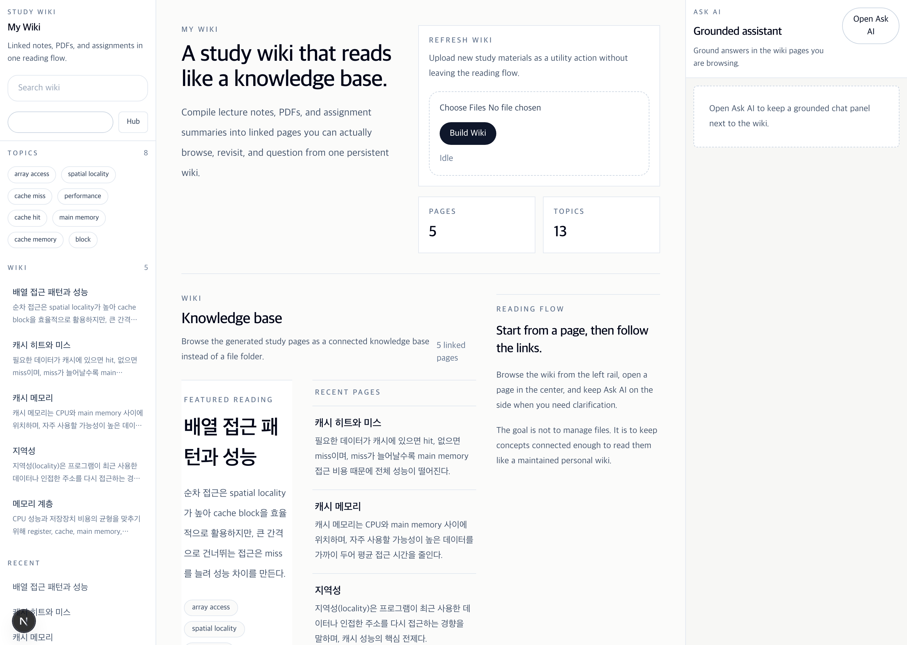

[English](./README.md) | [한국어](./README-ko.md)

## My Wiki

My Wiki is a Next.js app that turns uploaded source files into generated wiki pages and answers chat questions only from those pages.

## Project Overview

- Upload documents into the app.
- Generate wiki pages from the uploaded content.
- Ask the chat assistant questions about the generated wiki pages.
- Keep responses grounded in the wiki content only.

This MVP does not use a vector database. Page selection is done from the generated wiki pages on disk, then the chat model is prompted with the selected page excerpts.

## Demo Scenario

The fixed demo scenario uses the curated `Computer Architecture - Cache and Memory Hierarchy` study set under `data/demo/cache-memory-hierarchy/`.

Recommended demo flow:

1. Upload lecture notes, slide material, and an assignment summary.
2. Generate linked wiki pages such as `캐시 메모리`, `지역성`, and `배열 접근 패턴과 성능`.
3. Open related wiki pages and follow document links.
4. Ask grounded chat questions such as `캐시 메모리는 왜 필요한가요?`.

## Demo GIF

The README demo GIF should be captured from the fixed scenario above and saved as `public/demo/study-wiki-demo.gif`.



## Local Setup

1. Install dependencies.

```bash
npm install
```

2. Create a local environment file in `my-wiki/.env.local`.

3. Start the development server.

```bash
npm run dev
```

4. Open `http://localhost:3000`.

## Local GGUF Chat Server

The chat backend expects an OpenAI-compatible endpoint. A local `llama.cpp` server works well for this MVP.

Example server command:

```bash
./llama-server \
  -m /models/gemma-4-E4B-it-Q4_K_M.gguf \
  --host 127.0.0.1 \
  --port 8080
```

Use the OpenAI-compatible base URL in `.env.local`:

```bash
CHAT_MODEL_BASE_URL=http://127.0.0.1:8080/v1
CHAT_MODEL_API_KEY=local
CHAT_MODEL_NAME=gemma-4-e4-b-it-q4
```

## Environment Variables

Set these values in `my-wiki/.env.local`:

- `CHAT_MODEL_BASE_URL`: OpenAI-compatible chat completion endpoint, such as `http://127.0.0.1:8080/v1`.
- `CHAT_MODEL_API_KEY`: Any placeholder string accepted by your local server. `local` is fine for `llama.cpp`.
- `CHAT_MODEL_NAME`: The model name sent to the endpoint. Use the name expected by your server or a local alias such as `gemma-4-e4-b-it-q4`.
- `STUDY_WIKI_DATA_DIR`: Optional relative subdirectory under `./data` for local storage isolation, such as `demo-run-1` or `test/session-a`.

## Product Guardrails

- Chat answers only from generated wiki pages.
- No vector database is used in this MVP.
- If no relevant wiki page exists, the chat refuses to guess.

These guardrails are enforced in the chat route and prompt:

- The route ranks generated wiki pages from local storage before calling the model.
- If nothing relevant is found, the API returns a refusal instead of asking the model to invent an answer.
- The prompt tells the model to answer only from the provided wiki excerpts and to say when the wiki does not contain the answer.

## Verification Commands

Run the full local verification pass from `my-wiki/`:

```bash
npx vitest run
npm run lint
npm run build
```

The app stores generated wiki files under `./data` by default. If you set `STUDY_WIKI_DATA_DIR`, keep it relative to `./data` rather than using an absolute filesystem path.
